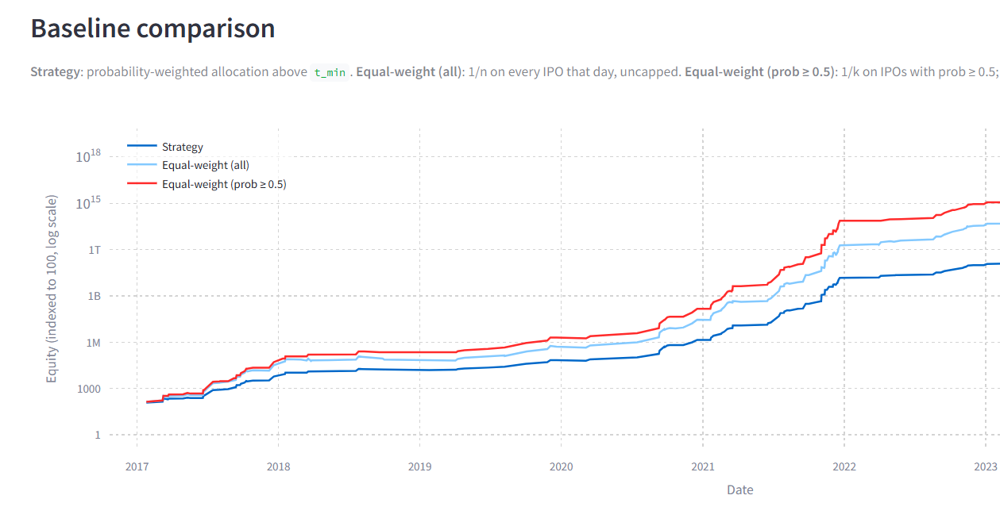

This file will contain knowledge about all the technical decisions and tradeoffs that had been taken in this project. If not needed and everything gets covered in readme, feel free to delete this

## Portfolio Allocator Working
We model allocation weights as:

    w_i ∝ p_i^α

after filtering IPOs using a minimum probability threshold (p_i > t_min).

The parameter α controls allocation concentration:
- α = 0 → equal allocation
- α > 0 → favor high-confidence IPOs
- α < 0 → slight diversification toward lower-confidence IPOs

We restrict α to a small range around zero:
    α ∈ {-0.5, -0.25, 0, 0.5, 1, 2}

Guardrails:
- Maximum allocation per IPO ≤ 60%
- If no IPO satisfies p_i > t_min → hold cash (no allocation)
- Minimum number of selected IPOs constraint (e.g., ≥ 1)
- Avoid extreme concentration by clipping weights before normalization

The optimal α and t_min are selected via backtesting based on total portfolio return and stability.


This section can be refined using business logic chat in chatgpt. The analysis done after threshold tuning of portfolio allocator is gold and should be documented

### Why was w_i ∝ p_i^α chosen as allocation strategy? Reasoning behind it? how did i come up with it?
We need optimal portfolio allocation strategy on the basis of risk profile of an IPO. We only have expected risk but have no idea of expected return. Need to allocate solely on the basis of risk Since we don't know expected returns, one option is to do equal allocation but a better approach would be to allocate proportionally on the basis of risk since capital will be safer in this case but we don't know whether w ∝ p_i is optimal or not. this may be too safe or too risky. so we instead do w_i ∝ p_i^α and tune α given that p_i > threshold. α=0 indicates equal weight, -ve alpha means less the p_i more the weight and +ve alpha means more the p_i more the weight however not as much more as in the case of α=0.

## Findings & Design Insights

### 1. Allocation Constraints Must Match Data Structure

An initial guardrail was introduced to cap maximum allocation per IPO at 60% as a risk control mechanism.

However, empirical analysis showed that:

* ~85% of IPO closing days contain only a single IPO
* The cap led to systematic under-deployment of capital on these days
* This resulted in degraded performance compared to simpler baselines

As a result, the constraint was removed in favor of context-aware allocation.

> Insight: Risk controls must be aligned with the structure of available opportunities. In sparse decision settings, hard allocation caps can act as artificial performance bottlenecks rather than genuine risk mitigations.
Strategy with guardrail
> 
---

### 2. Allocation Strategy Adds Limited Incremental Value

The probability-weighted allocation strategy:

```text
w_i ∝ p_i^α
```

was compared against a simpler baseline:

* Equal-weight allocation across IPOs with p ≥ 0.5

Results showed that:

* The proposed strategy performs only marginally better (or occasionally worse) than the baseline
* For most of the timeline, both strategies track closely

This is explained by the underlying data distribution:

* ~85% of days have only one IPO → allocation has no effect
* Only ~15% of days allow meaningful allocation decisions

> Insight: The primary value of the system lies in **selection (filtering positive expected value opportunities)** rather than **fine-grained allocation**.
Strategy without 0.6 guardrail

---

### 3. Problem Reframing

Based on the above observations, the problem is better characterized as:

```text
a decision/selection problem rather than a portfolio optimization problem
```

The model’s contribution is:

* Identifying a positive expected value region (p ≥ ~0.4)
* Filtering out negative expected value IPOs

Allocation acts as a secondary enhancement and has limited impact due to data sparsity.

---

### Key Takeaway

> In this setting, **getting the decision boundary right matters far more than optimizing capital allocation**, since most decision points do not involve competing alternatives.
